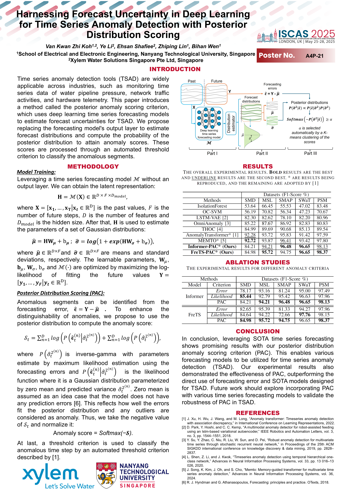

## Harnessing Forecast Uncertainty in Deep Learning for Time Series Anomaly Detection with Posterior Distribution Scoring

This repository is based on our **ISCAS 2025** conference paper:

**Harnessing Forecast Uncertainty in Deep Learning for Time Series Anomaly Detection with Posterior Distribution Scoring**
📄 *IEEE ISCAS 2025*
🔗 [https://ieeexplore.ieee.org/abstract/document/11043371](https://ieeexplore.ieee.org/abstract/document/11043371)

---

### Overview

We propose **Posterior Anomaly Criteria (PAC)**, a general framework for **time series anomaly detection (TSAD)** that leverages **forecast uncertainty** from probabilistic time series forecasting (TSF) models.

Instead of relying solely on point-wise prediction errors, PAC computes anomaly scores using the **posterior distribution of forecasts**, enabling more robust and uncertainty-aware anomaly detection—especially under noisy or non-stationary conditions.

---

### Key Idea: From TSF to TSAD

Our main insight is that **probabilistic forecasting models already contain rich uncertainty information**, which can be directly exploited for anomaly detection. PAC provides a principled way to convert probabilistic forecasts into anomaly scores via posterior distribution scoring.

---

### Extensions with FiLM and FreTS

In this work, we incorporate and evaluate:

* **FiLM (Feature-wise Linear Modulation)**
  🔗 [https://github.com/tianzhou2011/FiLM](https://github.com/tianzhou2011/FiLM)

* **FreTS (Frequency-domain Transformer for Time Series)**
  🔗 [https://github.com/aikunyi/FreTS](https://github.com/aikunyi/FreTS)

By integrating **FiLM** and **FreTS** with **PAC**, we demonstrate that:

* PAC is **model-agnostic**
* Advanced TSF architectures can be **directly leveraged for TSAD**
* Forecasting improvements translate into **better anomaly detection performance**

Our results show consistent improvements, confirming that **state-of-the-art TSF models can be effectively repurposed for TSAD through PAC**.

---

### Contributions

* Introduce **Posterior Anomaly Criteria (PAC)** for uncertainty-aware TSAD
* Bridge **probabilistic forecasting** and **anomaly detection**
* Demonstrate PAC’s compatibility with modern TSF models (FiLM, FreTS)
* Validate improvements on benchmark datasets

---
